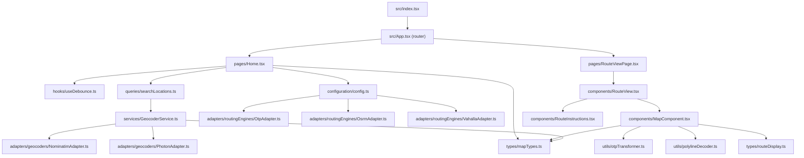
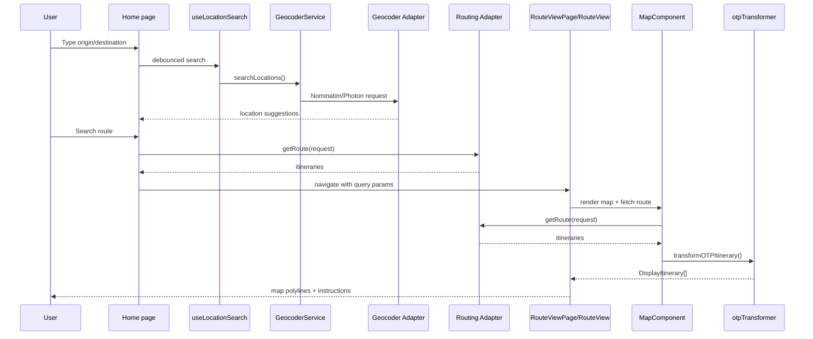

# GoTrotro Architecture Diagram

## Component Structure

```mermaid
flowchart TD
  A["src/index.tsx"] --> B["src/App.tsx (router)"]

  B --> P1["pages/Home.tsx"]
  B --> P2["pages/RouteViewPage.tsx"]

  %% Home side
  P1 --> H1["hooks/useDebounce.ts"]
  P1 --> Q1["queries/searchLocations.ts"]
  Q1 --> S1["services/GeocoderService.ts"]
  S1 --> G1["adapters/geocoders/NominatimAdapter.ts"]
  S1 --> G2["adapters/geocoders/PhotonAdapter.ts"]
  P1 --> C1["configuration/config.ts"]
  C1 --> R1["adapters/routingEngines/OtpAdapter.ts"]
  C1 --> R2["adapters/routingEngines/OsrmAdapter.ts"]
  C1 --> R3["adapters/routingEngines/VahallaAdapter.ts"]

  %% Route view side
  P2 --> V1["components/RouteView.tsx"]
  V1 --> M1["components/MapComponent.tsx"]
  V1 --> I1["components/RouteInstructions.tsx"]
  M1 --> U1["utils/otpTransformer.ts"]
  M1 --> U2["utils/polylineDecoder.ts"]
  M1 --> T2["types/routeDisplay.ts"]

  %% Shared typing
  P1 --> T1["types/mapTypes.ts"]
  M1 --> T1
  S1 --> T1
```

## Data Flow

```mermaid
sequenceDiagram
  participant User
  participant Home as Home page
  participant Query as useLocationSearch
  participant Service as GeocoderService
  participant Geocoder as Geocoder Adapter
  participant Router as Routing Adapter
  participant RoutePage as RouteViewPage/RouteView
  participant Map as MapComponent
  participant Transform as otpTransformer

  User->>Home: Type origin/destination
  Home->>Query: debounced search
  Query->>Service: searchLocations()
  Service->>Geocoder: Nominatim/Photon request
  Geocoder-->>Home: location suggestions

  User->>Home: Search route
  Home->>Router: getRoute(request)
  Router-->>Home: itineraries
  Home->>RoutePage: navigate with query params

  RoutePage->>Map: render map + fetch route
  Map->>Router: getRoute(request)
  Router-->>Map: itineraries
  Map->>Transform: transformOTPItinerary()
  Transform-->>RoutePage: DisplayItinerary[]
  RoutePage-->>User: map polylines + instructions
```

